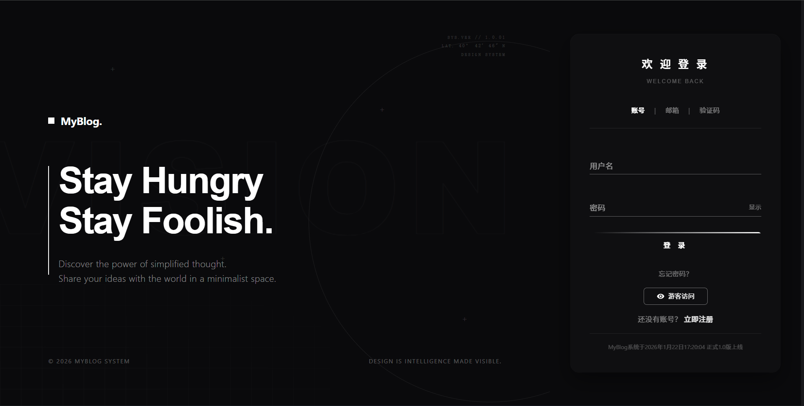
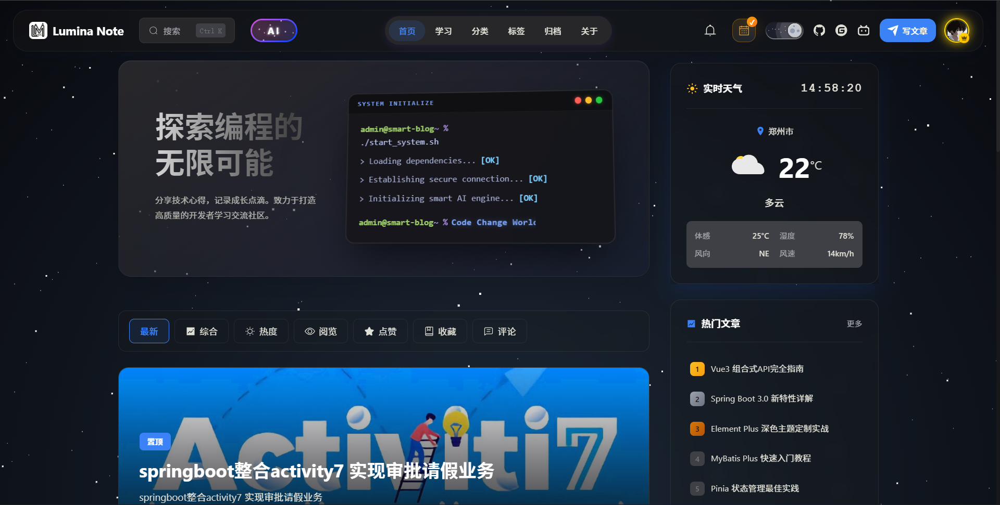
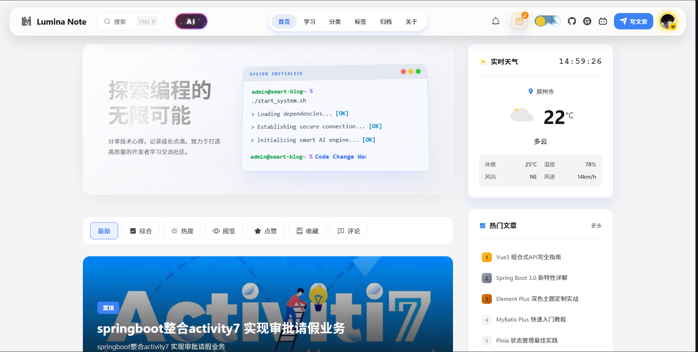
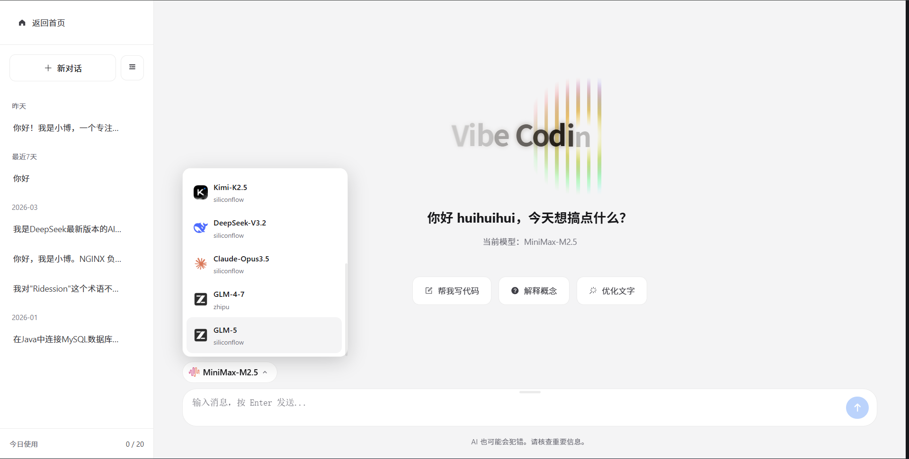
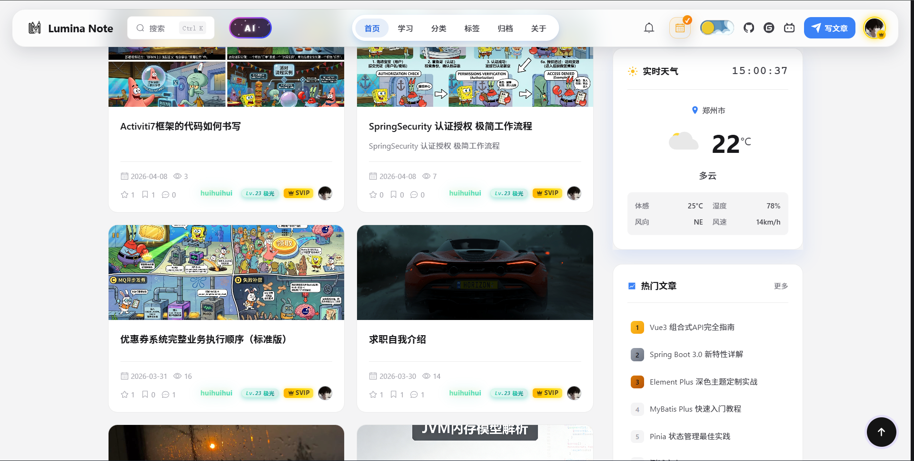
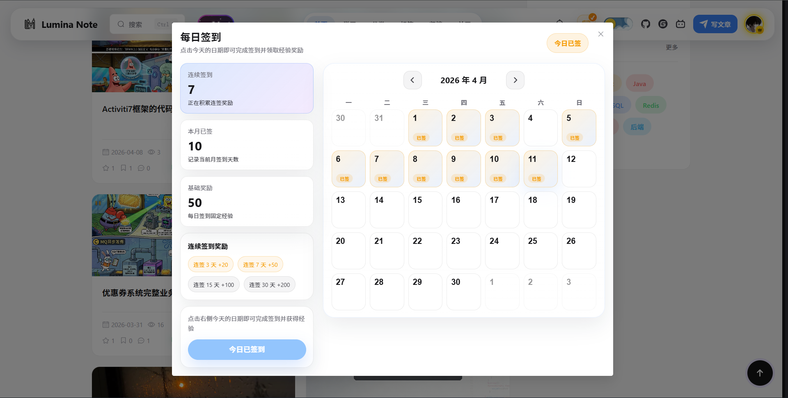
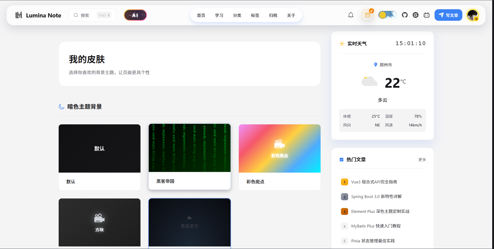
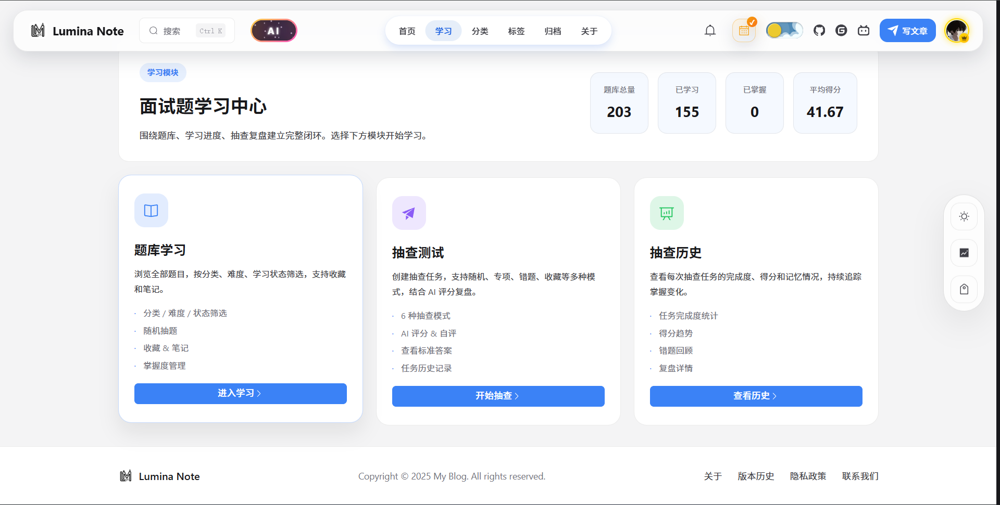
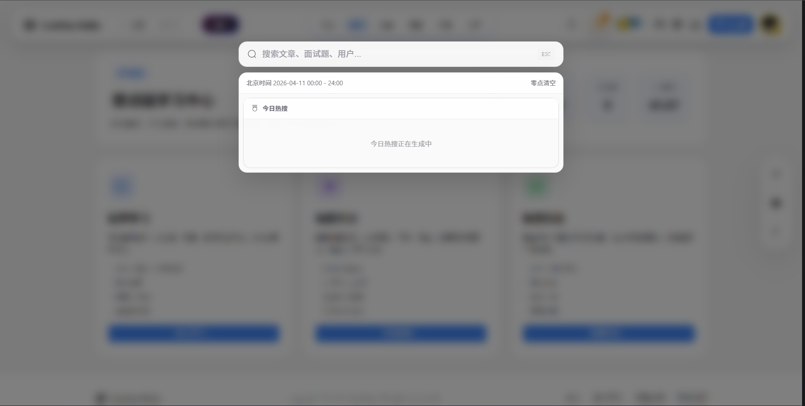

<!--
Description: Smart Blog System 是一个基于 Spring Boot、Vue 3 与微信小程序的前后端分离智能博客系统，内置博客内容管理、学习中心、会员体系、AI 助手、私信通知和后台管理能力。
Keywords: smart blog system, Spring Boot blog, Vue 3 blog, 微信小程序博客, AI 博客系统, 博客后台管理系统
author: HuiMiao
-->

# Smart Blog System

一个面向内容创作、学习成长和社区互动的智能博客系统，采用前后端分离架构，包含 `backend` 后端、`frontend/user` 用户端、`frontend/admin` 管理端以及 `miniprogram` 微信小程序端。

[](https://github.com/miaohui789/smart-blog-system)
[](#技术栈)
[](#技术栈)
[](#技术栈)
[](#技术栈)
[](#技术栈)

## 项目简介

这个仓库并不只是一个基础博客模板，它已经扩展出完整的内容平台能力：

- 博客文章、分类、标签、归档、评论、点赞、收藏、发布与编辑
- 用户注册登录、邮箱验证码、找回密码、个人中心、关注粉丝
- 学习中心、题库练习、抽查任务、经验等级、每日签到
- VIP 会员中心、密钥激活、加热记录、会员统计
- AI 助手、私信、通知、WebSocket 实时消息
- 后台仪表盘、系统配置、角色菜单、操作日志、AI 配置
- 微信小程序端内容浏览与核心互动能力

如果你要做一个带博客内容管理、用户体系、学习模块和 AI 扩展的完整项目，这个仓库可以直接作为基础工程继续开发。

## 功能总览

### 用户端

- 首页推荐、文章详情、分类、标签、归档、关于页、版本历史
- 注册、密码登录、邮箱验证码登录、找回密码
- 评论、点赞、收藏、写文章、编辑文章
- 用户主页、我的文章、我的收藏、关注与粉丝
- 私信中心、通知中心、资料维护
- 学习中心、题库练习、抽查历史、经验成长体系
- VIP 激活、VIP 中心、AI 助手

### 管理端

- 仪表盘统计
- 文章、分类、标签、评论管理
- 学习分类、学习题库、抽查记录管理
- 用户管理、关注管理、私信管理、通知管理
- 角色、菜单、系统配置、版本管理、操作日志
- VIP 会员、会员密钥、加热记录、统计分析
- AI 模型配置、Logo 管理

### 微信小程序

- 文章浏览与用户中心能力
- AI、VIP 等分包页面
- 基于 `@vant/weapp` 的移动端交互体验

## 界面预览

### 1. 登录页



简洁的登录入口页，支持账号、邮箱、验证码等多种登录方式，同时保留游客访问入口，适合作为社区型产品的首屏落点。

### 2. 首页暗色主题



暗色主题首页集成了站点导航、AI 入口、天气卡片、热门文章和内容列表，整体更偏开发者社区和夜间浏览场景。

### 3. 首页亮色主题



亮色主题首页保持同一套信息结构，适合偏内容阅读与日常使用场景，体现了项目支持多主题切换的能力。

### 4. AI 助手页面



内置 AI 对话界面，支持多模型切换和历史会话管理，可用于问答、写作辅助、代码帮助和文本优化等场景。

### 5. 文章内容流



文章列表页采用卡片式内容流布局，结合封面图、互动数据、作者信息与热门侧栏，方便构建内容社区首页。

### 6. 每日签到弹窗



签到模块将连续签到、本月签到、经验奖励和日历状态结合在一起，用于支撑成长体系、活跃激励和用户留存。

### 7. 皮肤主题中心



主题皮肤页支持多种背景风格切换，增强了前台个性化体验，也适合继续扩展成会员专属主题能力。

### 8. 学习中心首页



学习中心提供题库学习、抽查测试、抽查历史等模块，并配套学习数据统计，适合知识型社区或面试题平台。

### 9. 全局搜索弹层



搜索弹层支持按文章、题库、用户等维度统一检索，适合作为整站内容入口，后续也可以接入热搜与智能推荐。

## 技术栈

| 分类 | 技术 |
|------|------|
| 后端 | Java 17、Spring Boot 2.7.15、Spring Security、MyBatis Plus 3.5.4、JWT、Redis、RabbitMQ、WebSocket、Knife4j |
| 用户端 | Vue 3.3.4、Vue Router 4、Pinia、Element Plus、Vite、Axios、md-editor-v3、marked、highlight.js |
| 管理端 | Vue 3.3.4、Element Plus、Pinia、ECharts、Vite、Axios |
| 小程序 | 原生微信小程序、`@vant/weapp` |
| 数据与中间件 | MySQL 8.0+、Redis 7.0+、RabbitMQ、可选 Elasticsearch |

## 项目结构

```text
smart-blog-system/
├── backend/                 # Spring Boot 后端，默认端口 8080
├── frontend/
│   ├── user/                # 用户端，默认端口 5173
│   └── admin/               # 管理端，默认端口 5174
├── miniprogram/             # 微信小程序
├── docs/                    # 项目文档与数据库脚本
├── deploy/                  # Docker / Nginx / 宝塔部署相关配置
├── sql/                     # SQL 相关资源
├── uploads/                 # 上传文件目录
└── README.md
```

## 核心模块

### 后端接口

`backend/src/main/java/com/blog/controller/web`

- `ArticleController`：文章列表、详情与内容浏览
- `CommentController`：评论交互
- `SearchController`：搜索能力
- `StudyController`：学习中心
- `UserController`：认证与用户资料
- `UserExpController`：经验、等级、签到
- `MessageController`：私信消息
- `NotificationController`：通知消息
- `VipController`：VIP 业务
- `AiChatController`：AI 对话能力

`backend/src/main/java/com/blog/controller/admin`

- `DashboardController`：后台首页统计
- `AdminArticleController`：内容管理
- `AdminStudyCategoryController`、`AdminStudyQuestionController`、`AdminStudyCheckController`：学习模块后台
- `AdminUserController`：用户管理
- `AdminRoleController`、`AdminMenuController`、`AdminConfigController`：系统管理
- `AdminLogController`：操作日志
- `AdminVipController`：会员管理
- `AdminAiConfigController`、`AdminAiLogoController`：AI 配置管理

## 运行环境

### 基础依赖

- JDK 17
- Maven 3.8+
- Node.js 16+
- MySQL 8.0+
- Redis 7.0+

### 建议依赖

- RabbitMQ：用于异步消息、经验联动、通知扩展
- Elasticsearch：默认可关闭，启用后可增强搜索能力

## 快速开始

### 1. 初始化数据库

数据库脚本路径：

```bash
docs/database/blog_db.sql
```

导入示例：

```bash
mysql -uroot -p123456 < docs/database/blog_db.sql
```

### 2. 配置后端

核心配置文件：

- `backend/src/main/resources/application.yml`
- `backend/src/main/resources/application-dev.yml`

默认开发环境配置：

```yaml
spring:
  datasource:
    url: jdbc:mysql://localhost:3306/blog_db?useUnicode=true&characterEncoding=utf8&serverTimezone=Asia/Shanghai
    username: root
    password: 123456
  redis:
    host: localhost
    port: 6379
    database: 6
```

如果你要启用完整功能，还需要按实际环境补齐：

- `spring.mail`
- `spring.rabbitmq`
- `blog.search.elasticsearch`
- AI 相关接口配置

### 3. 启动后端

```bash
cd backend
mvn clean spring-boot:run
```

访问：

```text
http://localhost:8080
```

### 4. 启动用户端

```bash
cd frontend/user
npm install
npm run dev
```

访问：

```text
http://localhost:5173
```

### 5. 启动管理端

```bash
cd frontend/admin
npm install
npm run dev
```

访问：

```text
http://localhost:5174
```

### 6. 启动微信小程序

```bash
cd miniprogram
```

然后使用微信开发者工具打开 `miniprogram` 目录即可。

## 部署说明

仓库内已经提供部署相关目录，可按你的环境继续完善：

- `deploy/`：Docker、Nginx、宝塔部署配置
- `docs/`：文档与数据库脚本
- `uploads/`：运行期上传文件目录

生产环境部署时，建议至少补充以下内容：

- 独立的生产数据库与 Redis
- HTTPS 与反向代理配置
- 上传目录持久化挂载
- 邮件、消息队列、AI 接口密钥等敏感配置改为环境变量或私有配置文件

## 适用场景

- 个人博客与社区平台
- 带后台管理的内容系统
- 带会员体系和成长体系的知识平台
- 带 AI 能力扩展的内容产品
- 带微信小程序入口的前后端分离项目

## 开发建议

- 提交代码前先检查 `backend`、`frontend/user`、`frontend/admin` 的本地配置
- 将敏感配置写入本地私有配置文件，不要直接提交到仓库
- 将运行期产物、IDE 文件、日志文件和缓存目录加入 `.gitignore`

## 路线规划

- 补充单元测试与集成测试
- 完善 Docker 一键部署能力
- 增强 AI 能力与多模型接入
- 继续完善搜索、推荐与数据统计

## License

当前仓库未显式提供 `LICENSE` 文件，如需开源发布，建议补充合适的许可证后再公开分发。

## 开发者

<p align="center">
  
  
</p>

## 支持一下我们

<p align="center">
  
  
</p>
