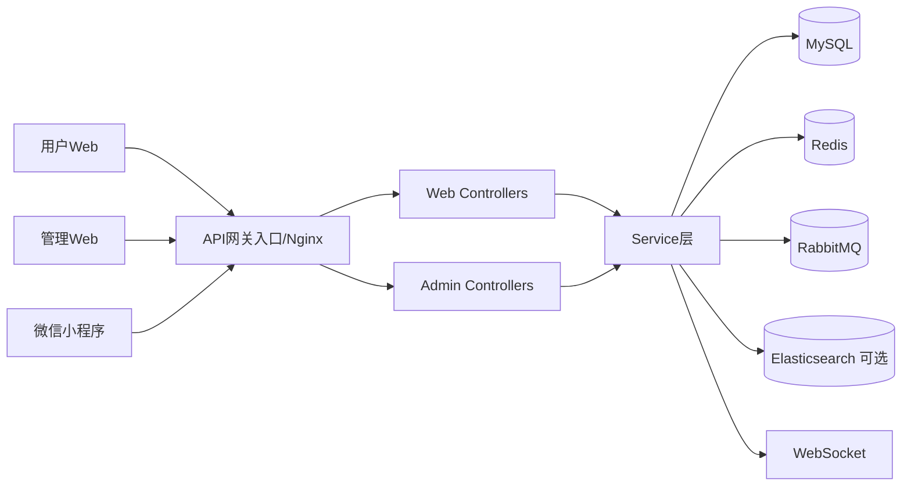

# Smart Blog System 全项目详细技术讲解（含简历项目描述）

## 1. 项目定位与业务目标

Smart Blog System 是一个面向内容社区场景的多端系统，目标是提供：

- 用户内容创作与消费：写作、发布、阅读、评论、点赞、收藏
- 社交互动：关注关系、私信消息、通知提醒、实时互动
- 会员权益：VIP 激活码、权益次数控制、会员中心
- AI 能力：AI 对话、模型管理、流式响应
- 管理后台：内容管理、用户管理、日志查询、AI/VIP 配置

系统形态是“三端一后端”：

- 用户 Web 端（Vue3）
- 管理 Web 端（Vue3）
- 微信小程序端（原生小程序）
- Spring Boot 后端统一 API 与业务中台

---

## 2. 整体架构设计

### 2.1 架构风格

- 后端采用单体分层架构：Controller → Service → Mapper → MySQL
- 中间件采用按需引入：Redis（缓存/令牌状态）、RabbitMQ（异步事件）、WebSocket（实时）、Elasticsearch（可选搜索增强）
- 前端采用前后端分离，三端复用后端接口标准

### 2.2 逻辑分层

**接口层（Controller）**
- `web` 命名空间：用户侧业务接口（`/api/**`）
- `admin` 命名空间：后台管理接口（`/api/admin/**`）

**业务层（Service）**
- 负责核心业务规则：文章、评论、用户、关注、AI、VIP、经验值等
- 处理事务、一致性、缓存与异步事件联动

**数据访问层（Mapper）**
- 基于 MyBatis-Plus 实现数据库访问
- 通过实体与查询包装器完成 CRUD 与复杂查询

**基础能力层**
- 安全：Spring Security + JWT
- 缓存：RedisService 统一封装
- 实时：WebSocketServer
- 异步：RabbitMQ 发布与消费
- 搜索：ES 优先、DB 兜底

### 2.3 核心架构图（逻辑）

---

## 3. 技术栈与选型理由

## 3.1 后端技术栈

- Java 17 + Spring Boot 2.7.x
- Spring Security（认证授权）
- JWT（无状态登录）
- MyBatis-Plus（高效 ORM）
- Redis（缓存与会话控制）
- RabbitMQ（异步任务解耦）
- WebSocket（实时消息）
- Knife4j（接口文档）
- OkHttp（外部服务调用，如 AI）

**选型理由**
- Spring 生态成熟，适合快速构建中大型业务后台
- JWT + Redis 在“高并发 + 可撤销登录”之间平衡
- MyBatis-Plus 降低 CRUD 开发成本
- RabbitMQ 将非核心链路异步化，减小主路径延迟

## 3.2 前端技术栈

**用户端 / 管理端**
- Vue3 + Vite + Vue Router + Pinia + Element Plus
- Axios 封装请求，统一拦截器处理 token 与异常

**小程序端**
- 微信原生小程序 + Vant Weapp
- 主包 + 分包（VIP、AI），降低首包体积

---

## 4. 模块级详细技术讲解

## 4.1 认证与授权模块

### 设计目标
- 低耦合无状态认证
- 支持登出、强制下线、单设备登录
- 管理接口与用户接口分区控制

### 关键实现
- 登录成功签发 JWT
- 请求进入过滤器解析 token，构建安全上下文
- Redis 维护 token 状态和黑名单
- 管理端接口统一要求已认证

### 面试亮点表达
- “JWT 负责身份声明，Redis 负责会话可控性，两者组合解决纯 JWT 不可撤销的问题。”

---

## 4.2 文章模块（发布-分发-互动）

### 核心流程
1. 用户创建/编辑文章  
2. Service 落库并处理标签关联  
3. 清理缓存并同步搜索索引  
4. 用户浏览文章时走缓存优先策略  
5. 点赞/收藏写关联表并更新计数  

### 技术要点
- 缓存与数据库双写一致性：使用事务后回调/延迟删除避免脏读
- 浏览统计防刷：结合 IP 和时间窗口控制
- 搜索可用性：ES 不可用时 DB 兜底

### 面试亮点表达
- “写操作完成后统一触发缓存失效与索引同步，保证检索与详情页一致。”

---

## 4.3 评论模块（树结构 + 实时通知）

### 核心流程
1. 评论写入（支持父子评论）  
2. 维护文章评论数  
3. 触发通知与 WebSocket 广播  
4. 删除评论时递归处理子评论并修正计数  

### 技术要点
- 评论树构建策略：顶级评论 + 子评论归并
- 实时能力：评论消息推送到在线用户
- 业务联动：评论可触发经验值发放事件

### 面试亮点表达
- “评论模块不是孤立的 CRUD，而是与文章统计、通知、经验系统形成事件联动。”

---

## 4.4 用户与社交模块

### 包含能力
- 个人资料、头像、密码修改
- 个人主页、文章列表、收藏点赞列表
- 关注/取关、粉丝/关注列表
- 私信与系统通知

### 技术要点
- 关注关系写入后同步维护用户统计字段
- 高频列表接口配合分页与缓存降低数据库压力
- 用户状态变化与消息系统联动

---

## 4.5 AI 模块（会话与流式输出）

### 核心流程
1. 创建/校验会话  
2. 校验模型权限与日配额  
3. 落库用户问题  
4. 调用外部模型并流式返回（SSE）  
5. 落库 AI 回复并累计使用量  

### 技术要点
- 流式响应提升首字节体验
- 会话持久化可做上下文追溯
- 配额控制防止资源滥用

### 面试亮点表达
- “把 AI 能力做成可运营模块：有配置、有权限、有配额、有审计数据。”

---

## 4.6 VIP 会员模块

### 当前业务模型
- 会员通过激活码开通，不依赖在线支付链路
- 会员具备特定权益（次数、功能解锁）
- 到期时间与权益消耗由服务层统一校验

### 技术要点
- 激活码校验与幂等处理
- 会员状态与用户信息表同步
- 权益扣减与并发冲突控制

---

## 4.7 搜索模块（ES 增强 + DB 兜底）

### 设计策略
- 优先使用 Elasticsearch 实现全文检索
- ES 不可用时回落到数据库检索，保障服务连续性
- 热搜关键词写 Redis，支撑热点推荐与运营分析

### 面试亮点表达
- “搜索服务以可用性优先，做了显式降级策略，不让 ES 成为单点故障源。”

---

## 4.8 经验值与成长体系（异步化）

### 核心流程
1. 文章/评论/互动触发经验值事件  
2. 事件发布到 RabbitMQ  
3. 消费端幂等消费并落库  
4. 刷新用户等级/经验状态  

### 技术价值
- 主业务链路解耦，降低响应时延
- 提升吞吐与抗峰值能力
- 通过幂等控制避免重复加经验

---

## 5. 数据层设计与一致性策略

## 5.1 数据库组织

- 主体表覆盖用户、文章、评论、标签、关注、消息、通知、VIP、经验值等
- 数据初始化与升级以 SQL 脚本维护
- 暂未引入 Flyway/Liquibase 统一迁移管理

## 5.2 缓存策略

- 读多写少场景优先缓存：文章详情、热门数据、配置项
- 写操作触发缓存失效/刷新
- token 与黑名单状态放 Redis，支持快速鉴权与撤销

## 5.3 一致性策略

- 核心事务在 Service 层控制
- 缓存更新采用“事务后动作”减少脏数据概率
- 异步场景通过事件幂等避免重复副作用

---

## 6. 前端三端工程实践

## 6.1 用户 Web 端

- 路由按业务域拆分：首页、文章、分类、标签、搜索、用户中心、写作、AI、VIP
- Pinia 按模块管理状态（用户、通知、配置、主题）
- 请求层统一处理 token 注入、401 失效、错误提示

## 6.2 管理 Web 端

- AdminLayout + 动态路由
- 权限元信息控制页面访问
- 功能覆盖：文章/评论/用户管理、日志查询、AI 配置、VIP 配置、系统设置

## 6.3 小程序端

- 主包承载高频页面，VIP/AI 放分包降低首包
- 启动时做登录态检查、用户信息拉取、WebSocket 建连
- 支持开发/生产环境切换，适配不同域名策略

---

## 7. 工程化、部署与运行

## 7.1 构建与发布

- 前端：Vite 构建，手动拆包优化
- 后端：Maven 打包 Spring Boot Jar
- 管理端部署在 `/admin/` 子路径，需与路由 base 对齐

## 7.2 容器化部署

- Docker Compose 编排核心服务：MySQL、Redis、Backend
- Nginx 负责静态托管、API 反向代理、WebSocket 升级、SSE 支持
- 提供部署脚本支持全量和分模块发布

## 7.3 运行链路

1. 用户请求到 Nginx  
2. 静态资源由 Nginx 直出  
3. API/WS 转发到后端  
4. 后端访问 DB/Redis/MQ/ES 完成业务  

---

## 8. 安全设计与风险评估

## 8.1 已有安全能力

- BCrypt 密码加密
- Spring Security + JWT 鉴权
- Redis 黑名单和单设备登录控制
- 全局异常统一拦截与响应

## 8.2 风险点（面试可主动复盘）

- 配置中存在敏感信息明文风险
- 生产密钥不应设置默认兜底值
- CORS 策略需要进一步收敛
- 鉴权可从“已登录”升级到“资源级权限”模型
- 日志监控体系可进一步标准化（指标、告警、链路追踪）

## 8.3 优化建议

- 引入密钥管理（环境变量 + 密钥平台）
- 基于角色/权限点构建细粒度 RBAC
- 增加审计日志落库链路与安全告警
- 增加限流、防刷、风控规则

---

## 9. 性能与可扩展性分析

## 9.1 现有性能手段

- 缓存热点数据减少 DB 压力
- 异步化经验值等非核心链路
- 前端拆包与静态缓存优化
- 实时能力走 WebSocket，减少轮询成本

## 9.2 可扩展演进路径

- 先分层内聚再做模块拆分：搜索、AI、消息可独立服务化
- 建立统一配置中心与注册发现后，逐步微服务化
- 补齐可观测平台后再放大集群规模

---

## 10. 面试可复述的“技术亮点”

- 三端复用一套后端业务能力，接口域清晰，研发效率高
- JWT + Redis 实现“无状态认证 + 可控会话”组合方案
- 评论/互动/经验值构建了事件驱动的业务联动
- 搜索做了 ES 可选与 DB 兜底，强调高可用
- AI 模块具备会话、配额、流式输出、运营配置能力
- 部署链路完整，支持容器化与脚本化落地

---

## 11. 面试高频追问与回答模板

## 11.1 为什么不用纯 JWT？

纯 JWT 无法撤销，无法天然支持单设备登录。引入 Redis 后可以维护 token 状态与黑名单，实现可强制下线、可登出、可控会话。

## 11.2 评论为什么要上 WebSocket？

评论和通知是强互动场景，WebSocket 能把消息时延从轮询粒度降低到事件级，提升实时体验并减少冗余请求。

## 11.3 搜索为什么需要降级兜底？

ES 功能强但依赖复杂，生产中存在短时不可用风险。通过 DB 兜底保证核心搜索功能不中断，优先保障可用性。

## 11.4 RabbitMQ 的收益是什么？

把经验值等非核心链路从主流程剥离，降低接口响应耗时；同时通过削峰与幂等消费提升稳定性。

## 11.5 你最想继续优化什么？

优先级是安全配置治理、自动化测试与 CI、数据库迁移标准化、可观测体系建设。

---

## 12. 简历项目描述（可直接复制）

## 12.1 一句话版（简历标题下）

负责 Smart Blog System 三端一体化平台研发，基于 Spring Boot + Vue3 + 微信小程序构建内容社区，落地 JWT 鉴权、Redis 缓存、WebSocket 实时互动、RabbitMQ 异步解耦与 AI 流式对话能力。

## 12.2 标准版（推荐）

主导并参与 Smart Blog System 全栈开发，搭建 Spring Boot 单体分层后端与 Vue3/小程序多端前台，围绕文章、评论、社交、会员、AI 对话等业务实现完整闭环。通过 JWT + Redis 实现可控登录态与单设备登录，使用 RabbitMQ 解耦经验值发放链路，结合 WebSocket 提升评论与消息实时性，构建 ES 可选+DB 兜底搜索方案，并完成 Docker Compose + Nginx 的部署落地，显著提升系统可用性与可维护性。

## 12.3 STAR 版（面试口述）

- **S（场景）**：需要构建一个覆盖 Web 用户端、管理端和微信小程序的内容社区平台，并支持 AI 与会员业务。
- **T（任务）**：在保证开发效率的同时，兼顾系统性能、可用性与可扩展性。
- **A（行动）**：设计并实现 Spring Boot 分层架构，落地 JWT+Redis 鉴权、WebSocket 实时通信、RabbitMQ 异步事件、ES 兜底搜索、Vite 前端工程化与容器化部署。
- **R（结果）**：形成可上线的三端统一业务平台，核心链路稳定，交互实时性与系统可维护性明显提升，具备继续服务化演进基础。

---

## 13. 个人面试表达建议

- 先讲业务价值，再讲技术决策，再讲落地细节，最后讲复盘优化
- 不只讲“用了什么”，重点讲“为什么这样用、解决了什么问题”
- 对风险点主动复盘会显著加分（安全、测试、可观测、迁移治理）

